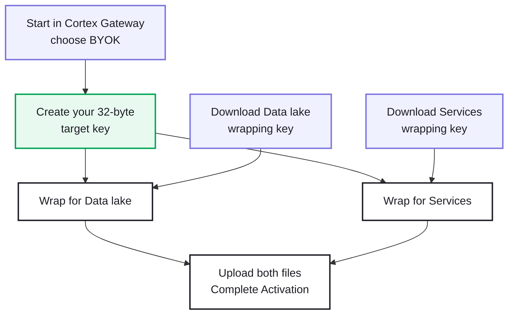

# Bring your own keys (BYOK)

First-time walkthrough for encrypting your Cortex tenant with a key **you** create and control.  
You work in [Cortex Gateway](https://apps.paloaltonetworks.com/) and on your computer.

> Styled companion page (local / offline): [`README.html`](./README.html)

Official docs: [Bring your own keys — Cortex Docs](https://cortex-docs.paloaltonetworks.com/cortex-xsiam/onboard-cortex-xsiam/deployment-steps/activate-cortex-xsiam/bring-your-own-keys)

## What this means for you

With BYOK, Cortex still hosts your tenant — but the master encryption key comes from you.

Your tenant needs encryption for two areas: the **Data lake** and other **Services**.  
You can use **one** key for both, or create **two** different keys. Most customers start with one shared key.

> [!NOTE]
> You create the secret **32-byte target key**. Cortex Gateway gives you temporary **wrapping keys** (`.pem` files). Wrapping keys only protect your secret during upload — they are **not** your BYOK key.

| Item | Who | What to do |
| --- | --- | --- |
| Target key (`targetkey`) | **You** | Create once, store safely. Never upload this file unwrapped. |
| Wrapping keys (`.pem`) | **Gateway** | Download for Data lake and Services. Valid up to 3 days. |
| Wrapped key files | **Upload** | Created by the helper script. Upload these in Gateway. |

## Process overview



## Files in this repo

| File | Purpose |
| --- | --- |
| [`run-byok.sh`](./run-byok.sh) | Launcher |
| [`byok-wrap-keys.sh`](./byok-wrap-keys.sh) | Generate / wrap keys |
| [`README.html`](./README.html) | Styled customer guide |
| [`.gitignore`](./.gitignore) | Blocks key material from git |

```bash
chmod +x byok-wrap-keys.sh run-byok.sh
```

## Step-by-step

### 1. Start BYOK in Cortex Gateway

Sign in to Cortex Gateway and activate your tenant.  
Under **Advanced**, select **BYOK (Bring Your Own Keys)**, then **Create Tenant and Set Up Keys**.

Initialization can take a few minutes. If you pause, continue later with **Set Up Encryption Keys** next to the tenant.

### 2. Create your 32-byte target key

On your computer:

```bash
./run-byok.sh generate targetkey
```

In Gateway, select **I have a 32-byte symmetric encryption key ready** and continue.

> [!CAUTION]
> Treat `targetkey` like a root secret. Back it up offline. Do not email it, store it in git, or upload it unwrapped.

### 3. Download wrapping keys

On the **Wrap & Upload** screen, repeat for **Data lake** and **Services**:

1. Choose import method `RSA_OAEP_3072_SHA256_AES_256` (default)
2. Download the wrapping `.pem`

> [!NOTE]
> Wrapping keys expire after three days. If they expire, download new ones before wrapping.

### 4. Wrap your target key

Place both `.pem` files next to the script, then run:

```bash
./run-byok.sh wrap-both \
  datalake_wrapping_key.pem \
  services_wrapping_key.pem \
  targetkey \
  ./out
```

Output:

- `out/datalakewrappedkey`
- `out/serviceswrappedkey`

The default import method needs [patched OpenSSL](https://docs.cloud.google.com/kms/docs/configuring-openssl-for-manual-key-wrapping) at `$HOME/local/bin/openssl.sh` (or set `OPENSSL_SH`).

### 5. Upload and complete activation

Upload the Data lake wrapped file, then the Services wrapped file.  
Click **Complete Activation**.

Your key becomes the primary encryption key for newly generated tenant data.

## Checklist

- [ ] BYOK selected during tenant activation
- [ ] 32-byte `targetkey` created and stored securely
- [ ] Data lake wrapping `.pem` downloaded
- [ ] Services wrapping `.pem` downloaded
- [ ] `wrap-both` completed successfully
- [ ] Both wrapped files uploaded
- [ ] Complete Activation selected

## Helper commands

```bash
./run-byok.sh generate [targetkey]
./run-byok.sh wrap <gateway_wrapping.pem> <targetkey> <wrapped_out>
./run-byok.sh wrap-both <datalake.pem> <services.pem> <targetkey> [out_dir]
```

> [!NOTE]
> File names such as `targetkey` and `datalake_wrapping_key.pem` are helper-script conventions. Use the wrapping files you download from Gateway, even if their names differ.
